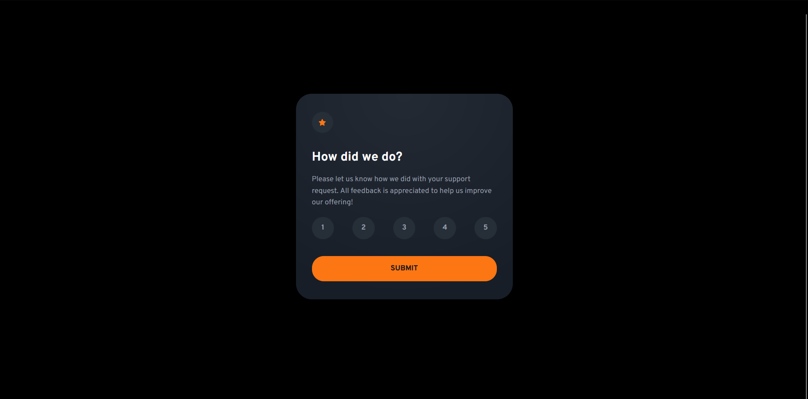

# Frontend Mentor - Interactive rating component solution

This is a solution to the [Interactive rating component challenge on Frontend Mentor](https://www.frontendmentor.io/challenges/interactive-rating-component-koxpeBUmI). Frontend Mentor challenges help you improve your coding skills by building realistic projects. 

## Table of contents

- [Overview](#overview)
  - [The challenge](#the-challenge)
  - [Screenshot](#screenshot)
  - [Links](#links)
- [My process](#my-process)
  - [Built with](#built-with)
  - [What I learned](#what-i-learned)
  - [Continued development](#continued-development)
- [Author](#author)

## Overview

### The challenge

Users should be able to:

- View the optimal layout for the app depending on their device's screen size
- See hover states for all interactive elements on the page
- Select and submit a number rating
- See the "Thank you" card state after submitting a rating

### Screenshot



### Links

- Solution URL: [GitHub Repo](https://github.com/Achigyus/interactive-rating-component-main)
- Live Site URL: [Live Site](https://interactive-rating-component-achigyus.netlify.app/)

## My process

### Built with

- Semantic HTML5 markup
- CSS custom properties
- Flexbox
- Mobile-first workflow
- Sass
- Gulp
- typescript

### What I learned

I finally learnt how to properly setup my gulpfile so the gulp process can handle errors properly, my previous gulp processes always stopped when an error was encountered

This was the code to help handle the errors:

```js
function buildStyles() {
  return src('./sass/**/*.sass')
    .pipe(sass().on('error', sass.logError)) // handles errors to prevent process stopping
    .pipe(dest('dist'));
}
```

### Continued development

Continued work on Typescript

## Author

- Website - [Achigyus](https://github.com/Achigyus)
- Frontend Mentor - [@Achigyus](https://www.frontendmentor.io/profile/Achigyus)